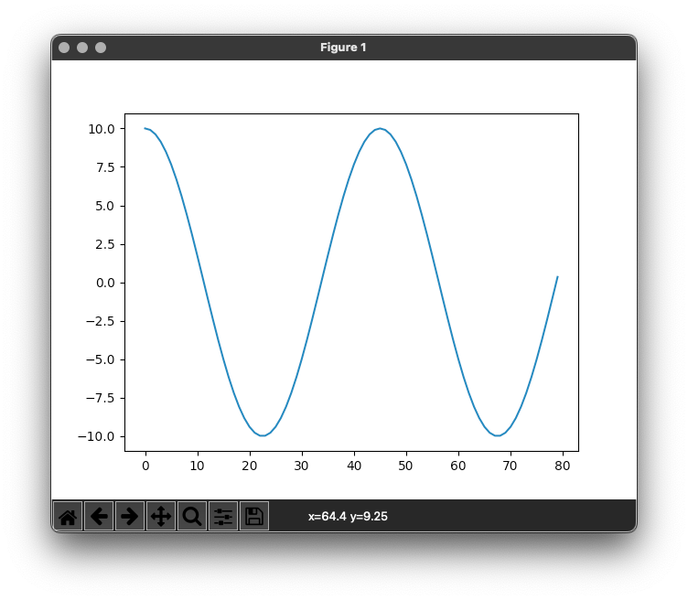

SPyQL
=====

SQL with Python in the middle

.. image:: https://img.shields.io/pypi/v/spyql.svg
   :target: https://pypi.org/project/spyql/
   :alt: https://pypi.python.org/pypi/spyql

.. image:: https://readthedocs.org/projects/spyql/badge/?version=latest
   :target: https://spyql.readthedocs.io/en/latest/
   :alt: https://spyql.readthedocs.io/en/latest/?version=latest

.. image:: https://codecov.io/gh/dcmoura/spyql/branch/master/graph/badge.svg?token=5C7I7LG814
   :target: https://codecov.io/gh/dcmoura/spyql
   :alt: codecov

.. image:: https://pepy.tech/badge/spyql
   :target: https://pepy.tech/project/spyql
   :alt: downloads

.. image:: https://img.shields.io/badge/code%20style-black-000000.svg
   :target: https://github.com/psf/black
   :alt: code style: black

.. image:: https://img.shields.io/badge/License-MIT-yellow.svg
   :target: https://opensource.org/licenses/MIT
   :alt: license: MIT

About
-----
.. intro_start

SPyQL is a query language that combines:

* the simplicity and structure of SQL;
* with the power and readability of Python.

.. code-block:: sql

   SELECT
       date.fromtimestamp(.purchase_ts) AS purchase_date,
       .price * .quantity AS total
   FROM json
   WHERE .department.upper() == 'IT'
   ORDER BY 2 DESC
   TO csv

SQL provides the structure of the query, while Python is used to define expressions, bringing along a vast ecosystem of packages.

SPyQL is fast and memory efficient. Take a look at the `benchmarks with GB-size JSON data <https://colab.research.google.com/github/dcmoura/spyql/blob/master/notebooks/json_benchmark.ipynb>`_.

SPyQL CLI
^^^^^^^^^

SPyQL offers a command-line interface that allows running SPyQL queries on top of text data (e.g. CSV, JSON). Data can come from files but also from data streams, such as as Kafka, or from databases such as PostgreSQL. Basically, data can come from any command that outputs text :-). More, data can be generated by a Python expression! And since  SPyQL also writes to different formats, it allows to easily convert between data formats.

Take a look at the Command line examples to see how to query parquet, process API calls, transverse directories of zipped JSONs, convert CSV to JSON, and import JSON/CSV data into SQL databases, among many other things.

See also:

* `Tutorial (v0.8) <https://danielcmoura.com/blog/2022/spyql-cell-towers/>`_

* `Demo video (v0.4) <https://vimeo.com/danielcmoura/spyqldemo>`_

SPyQL Module
^^^^^^^^^^^^

SPyQL is also available as a Python module. In addition to the CLI features, you can also:

* query variables (e.g. lists of dicts);
* get results into in-memory data structures.

Principles
^^^^^^^^^^

We aim for SPyQL to be:

* **Simple**\ : simple to use with a straightforward implementation;
* **Familiar**\ : you should feel at home if you are acquainted with SQL and Python;
* **Light**\ : small memory footprint that allows you to process large data that fit into your machine;
* **Useful**\ : it should make your life easier, filling a gap in the eco-system.

.. intro_end

Distinctive features of SPyQL
^^^^^^^^^^^^^^^^^^^^^^^^^^^^^

* Row order guarantee
* Natural window for aggregations
* No distinction between aggregate and window functions
* IMPORT clause
* Natural support for lists, sets, dictionaries, objects, etc
* 1-liner by design
* Multiple data formats supported

Testimonials
------------

|

   "I'm very impressed - this is some very neat pragmatic software design."

Simon Willison, Creator of Datasette, co-creator of Django

|

   "I love this tool! I use it every day"...

Alin Panaitiu, Creator of Lunar

|

   "Brilliant tool, thanks a lot for creating it and for the example here!"

Greg Sadetsky, Co-founder and CTO at Decibel Ads

|

Documentation
--------------

The official documentation of SPyQL can be found at: `<https://spyql.readthedocs.io/>`_.

Installation
------------

The easiest way to install SPyQL is from pip:

.. code-block:: sh

   pip install spyql

Hello world
-----------

.. hello_start

To test your installation run in the terminal:

.. code-block:: sh

   spyql "SELECT 'Hello world' as Message TO pretty"

Output:

.. code-block::

   Message
   -----------
   Hello world

You can try replacing the output format by JSON or CSV, and adding more columns. e.g. run in the terminal:

.. code-block:: sh

   spyql "SELECT 'Hello world' as message, 1+2 as three TO json"

Output:

.. code-block:: json

   {"message": "Hello world", "three": 3}

.. hello_end

.. recipes_start

Example queries
---------------

You can run the following example queries in the terminal:
``spyql "the_query" < a_data_file``

Example data files are not provided on most cases.

Query a CSV (and print a pretty table)
^^^^^^^^^^^^^^^^^^^^^^^^^^^^^^^^^^^^^^

.. code-block:: sql

   SELECT a_col_name, 'positive' if int(col2) >= 0 else 'negative' AS sign
   FROM csv
   TO pretty

Convert CSV to a flat JSON
^^^^^^^^^^^^^^^^^^^^^^^^^^

.. code-block:: sql

   SELECT * FROM csv TO json

Convert from CSV to a hierarchical JSON
^^^^^^^^^^^^^^^^^^^^^^^^^^^^^^^^^^^^^^^

.. code-block:: sql

   SELECT {'client': {'id': col1, 'name': col2}, 'price': 120.40} AS json
   FROM csv TO json

or

.. code-block:: sql

   SELECT {'id': col1, 'name': col2} AS client, 120.40 AS price
   FROM csv TO json

JSON to CSV, filtering out NULLs
^^^^^^^^^^^^^^^^^^^^^^^^^^^^^^^^

.. code-block:: sql

   SELECT .client.id AS id, .client.name AS name, .price
   FROM json
   WHERE .client.name is not NULL
   TO csv

Explode JSON to CSV
^^^^^^^^^^^^^^^^^^^

.. code-block:: sql

   SELECT .invoice_num AS id, .items.name AS name, .items.price AS price
   FROM json
   EXPLODE .items
   TO csv

Sample input:

.. code-block:: json

   {"invoice_num" : 1028, "items": [{"name": "tomatoes", "price": 1.5}, {"name": "bananas", "price": 2.0}]}
   {"invoice_num" : 1029, "items": [{"name": "peaches", "price": 3.12}]}

Output:

.. code-block::

   id, name, price
   1028, tomatoes, 1.5
   1028, bananas, 2.0
   1029, peaches, 3.12

Python iterator/list/comprehension to JSON
^^^^^^^^^^^^^^^^^^^^^^^^^^^^^^^^^^^^^^^^^^

.. code-block:: sql

   SELECT 10 * cos(col1 * ((pi * 4) / 90))
   FROM range(80)
   TO json

or

.. code-block:: sql

   SELECT col1
   FROM [10 * cos(i * ((pi * 4) / 90)) for i in range(80)]
   TO json

Importing python modules
^^^^^^^^^^^^^^^^^^^^^^^^

Here we import ``hashlib`` to calculate a md5 hash for each input line.
Before running this example you need to install the ``hashlib`` package (\ ``pip install hashlib``\ ).

.. code-block:: sql

   IMPORT hashlib as hl
   SELECT hl.md5(col1.encode('utf-8')).hexdigest()
   FROM text

Getting the top 5 records
^^^^^^^^^^^^^^^^^^^^^^^^^

.. code-block:: sql

   SELECT int(score) AS score, player_name
   FROM csv
   ORDER BY 1 DESC NULLS LAST, score_date
   LIMIT 5

Aggregations
^^^^^^^^^^^^

Totals by player, alphabetically ordered.

.. code-block:: sql

   SELECT .player_name, sum_agg(.score) AS total_score
   FROM json
   GROUP BY 1
   ORDER BY 1

Partial aggregations
^^^^^^^^^^^^^^^^^^^^

Calculating the cumulative sum of a variable using the ``PARTIALS`` modifier. Also demoing the lag aggregator.

.. code-block:: sql

   SELECT PARTIALS
       .new_entries,
       sum_agg(.new_entries) AS cum_new_entries,
       lag(.new_entries) AS prev_entries
   FROM json
   TO json

Sample input:

.. code-block:: json

   {"new_entries" : 10}
   {"new_entries" : 5}
   {"new_entries" : 25}
   {"new_entries" : null}
   {}
   {"new_entries" : 100}

Output:

.. code-block:: json

   {"new_entries" : 10,   "cum_new_entries" : 10,  "prev_entries": null}
   {"new_entries" : 5,    "cum_new_entries" : 15,  "prev_entries": 10}
   {"new_entries" : 25,   "cum_new_entries" : 40,  "prev_entries": 5}
   {"new_entries" : null, "cum_new_entries" : 40,  "prev_entries": 25}
   {"new_entries" : null, "cum_new_entries" : 40,  "prev_entries": null}
   {"new_entries" : 100,  "cum_new_entries" : 140, "prev_entries": null}

If ``PARTIALS``  was omitted the result would be equivalent to the last output row.

Distinct rows
^^^^^^^^^^^^^

.. code-block:: sql

   SELECT DISTINCT *
   FROM csv

Command line examples
---------------------

To run the following examples, type ``Ctrl-x Ctrl-e`` on you terminal. This will open your default editor (emacs/vim). Paste the code of one of the examples, save and exit.

Queries on Parquet with directories
^^^^^^^^^^^^^^^^^^^^^^^^^^^^^^^^^^^

Here, ``find`` transverses a directory and executes ``parquet-tools`` for each parquet file, dumping each file to json format. ``jq -c`` makes sure that the output has 1 json per line before handing over to spyql. This is far from being an efficient way to query parquet files, but it might be a handy option if you need to do a quick inspection.

.. code-block:: sh

   find /the/directory -name "*.parquet" -exec parquet-tools cat --json {} \; |
   jq -c |
   spyql "
       SELECT .a_field, .a_num_field * 2 + 1
       FROM json
   "

Querying multiple json.gz files
^^^^^^^^^^^^^^^^^^^^^^^^^^^^^^^

.. code-block:: sh

   gzcat *.json.gz |
   jq -c |
   spyql "
       SELECT .a_field, .a_num_field * 2 + 1
       FROM json
   "

Querying YAML / XML / TOML files
^^^^^^^^^^^^^^^^^^^^^^^^^^^^^^^^

`yq <https://kislyuk.github.io/yq/#>`_ converts yaml, xml and toml files to json, allowing to easily query any of these with spyql.

.. code-block:: sh

   cat file.yaml | yq -c | spyql "SELECT .a_field FROM json"

.. code-block:: sh

   cat file.xml | xq -c | spyql "SELECT .a_field FROM json"

.. code-block:: sh

   cat file.toml | tomlq -c | spyql "SELECT .a_field FROM json"

Kafka to PostegreSQL pipeline
^^^^^^^^^^^^^^^^^^^^^^^^^^^^^

Read data from a kafka topic and write to postgres table name ``customer``.

.. code-block:: sh

   kafkacat -b the.broker.com -t the.topic |
   spyql -Otable=customer -Ochunk_size=1 --unbuffered "
       SELECT
           .customer.id AS id,
           .customer.name AS name
       FROM json
       TO sql
   " |
   psql -U an_user_name -h a.host.com a_database_name

Monitoring statistics in Kafka
^^^^^^^^^^^^^^^^^^^^^^^^^^^^^^

Read data from a kafka topic, continuously calculating statistics.

.. code-block:: sh

   kafkacat -b the.broker.com -t the.topic |
   spyql --unbuffered "
       SELECT PARTIALS
           count_agg(*) AS running_count,
           sum_agg(value) AS running_sum,
           min_agg(value) AS min_so_far,
           value AS current_value
       FROM json
       TO csv
   "

Sub-queries (piping)
^^^^^^^^^^^^^^^^^^^^

A special file format (spy) is used to efficiently pipe data between queries.

.. code-block:: sh

   cat a_file.json |
   spyql "
       SELECT ' '.join([.first_name, .middle_name, .last_name]) AS full_name
       FROM json
       TO spy" |
   spyql "SELECT full_name, full_name.upper() FROM spy"

(Equi) Joins
^^^^^^^^^^^^^

It is possible to make simple (LEFT) JOIN operations based on dictionary lookups.

Given `numbers.json`:

.. code-block:: json

   {
      "1": "One",
      "2": "Two",
      "3": "Three"
   }

Query:

.. code-block:: sh

   spyql -Jnums=numbers.json "
	   SELECT nums[col1] as res
	   FROM [3,4,1,1]
	   TO json"

Output:

.. code-block:: json

   {"res": "Three"}
   {"res": null}
   {"res": "One"}
   {"res": "One"}

If you want a INNER JOIN instead of a LEFT JOIN, you can add a criteria to the where clause, e.g.:

.. code-block:: sql

   SELECT nums[col1] as res
   FROM [3,4,1,1]
   WHERE col1 in nums
   TO json

Output:

.. code-block:: json

   {"res": "Three"}
   {"res": "One"}
   {"res": "One"}

Queries over APIs
^^^^^^^^^^^^^^^^^

.. code-block:: sh

   curl https://reqres.in/api/users?page=2 |
   spyql "
       SELECT
           .data.email AS email,
           'Dear {}, thank you for being a great customer!'.format(.data.first_name) AS msg
       FROM json
       EXPLODE .data
       TO json
   "

Plotting to the terminal
^^^^^^^^^^^^^^^^^^^^^^^^

.. code-block:: sh

   spyql "
       SELECT col1
       FROM [10 * cos(i * ((pi * 4) / 90)) for i in range(80)]
       TO plot
   "

Plotting with `matplotcli <https://github.com/dcmoura/matplotcli>`_
^^^^^^^^^^^^^^^^^^^^^^^^^^^^^^^^^^^^^^^^^^^^^^^^^^^^^^^^^^^^^^^^^^^^

.. code-block:: sh

   spyql "
      SELECT col1 AS y
      FROM [10 * cos(i * ((pi * 4) / 90)) for i in range(80)]
      TO json
   " | plt "plot(y)"

.. recipes_end

----

This package was created with `Cookiecutter <https://github.com/audreyr/cookiecutter>`_ and the ``audreyr/cookiecutter-pypackage`` `project template <https://github.com/audreyr/cookiecutter-pypackage>`_.
